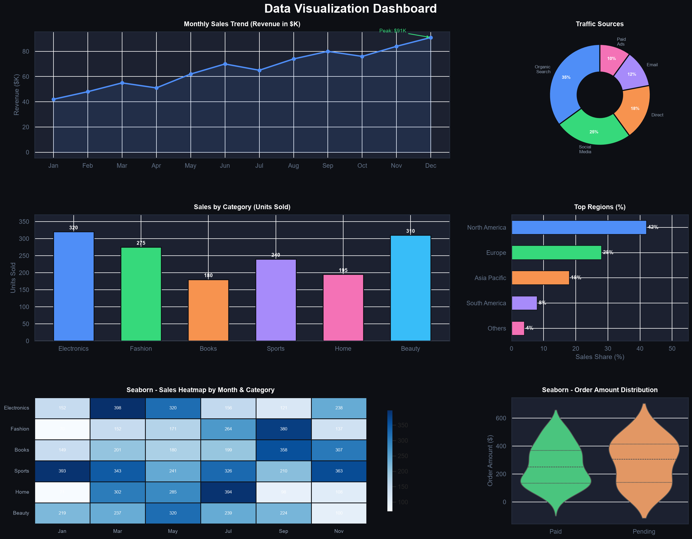

# CodeAlpha_Data-Visualization
# 📊 Data Visualization Dashboard
### Task  — Matplotlib & Seaborn | Python Project



---

## 📁 Project Structure

```
data-visualization-dashboard/
├── dashboard.py          → Main Python visualization script
├── requirements.txt      → Required libraries
├── dashboard_output.png  → Generated dashboard image
└── README.md             → This file
```

---

## 📈 Charts Included

| Chart | Library | Description |
|-------|---------|-------------|
| Line Chart | Matplotlib | Monthly sales trend (12 months) |
| Bar Chart | Matplotlib | Units sold by category |
| Pie Chart | Matplotlib | Traffic source breakdown |
| Horizontal Bar | Matplotlib | Top regions by sales share |
| Heatmap | Seaborn | Sales by month & category |
| Violin Plot | Seaborn | Order amount distribution |

---

## 🛠️ Libraries Used

- **Matplotlib** — Core plotting library
- **Seaborn** — Statistical data visualization
- **Pandas** — Data handling & DataFrames
- **NumPy** — Numerical data generation

---

## 🚀 How to Run

**Step 1 — Install libraries:**
```bash
pip install -r requirements.txt
```

**Step 2 — Run the script:**
```bash
python dashboard.py
```

**Output:**
- Chart will open on screen automatically
- Image saved as `dashboard_output.png` in same folder

---

## 📌 Task Reference

This project fulfills **Task 3: Data Visualization**:

- ✅ Raw data transformed into visual formats
- ✅ Matplotlib used for charts & graphs
- ✅ Seaborn used for statistical visualizations
- ✅ Designed to enhance understanding & reveal insights
- ✅ Portfolio-ready dashboard

---

Made with ❤️ for Data Science Portfolio
